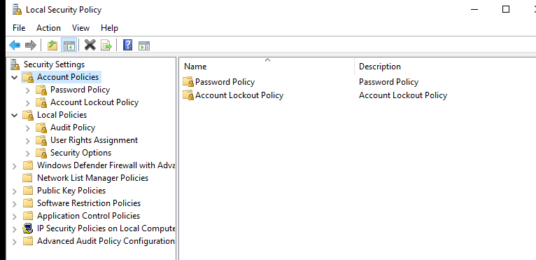
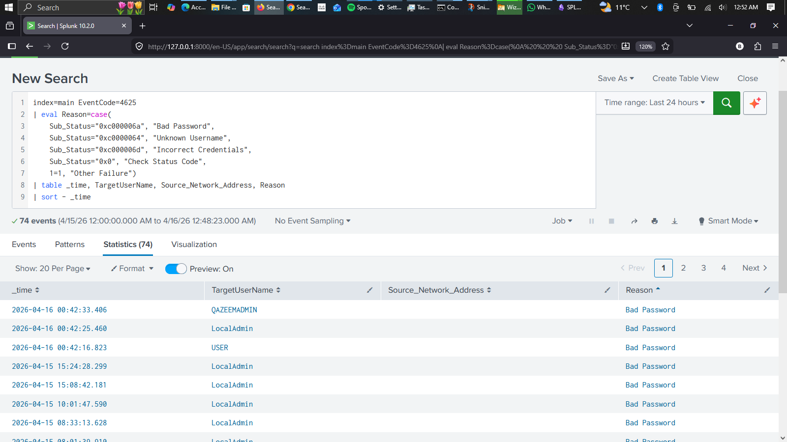

# SOC Lab #002: Hybrid Threat Monitoring & SIEM Integration (Advanced Audit Log Analytics)

## 📌 Overview
This repository documents **SOC Lab #002**, focusing on hybrid threat monitoring, advanced Windows audit policy configuration, and centralized log aggregation using **Splunk SIEM**. The lab addresses the "Visibility Gap" by transitioning from static system hardening to active surveillance and telemetry analysis.

---

## 🛠️ Lab Methodology & Implementation

The project was executed across four main phases to build an active detection pipeline:

*   **Phase 1: Advanced Audit Policy Configuration**
    *   Transitioned the Windows endpoint from "Basic" to **Advanced Audit Policy Configuration** using `secpol.msc` to capture high-risk kernel telemetry.
    *   Targeted granular tracking for **Logon/Logoff**, **Process Creation (Event ID 4688)** for living-off-the-land binaries, and sensitive **Object Access**.
    *   *Configuration Preview:*
         

*   **Phase 2: SIEM Integration & Normalization**
    *   Ingested raw, siloed Windows Security Event logs into a centralized **Splunk Enterprise** instance.
    *   Utilized **Search Processing Language (SPL)** to filter background noise and isolate authentication anomalies.

*   **Phase 3: Behavioral Analysis & Anomaly Detection**
    *   Analyzed authentication failure patterns (**Event ID 4625**) using temporal timecharts and statistical breakdowns.
    *   Identified targeted high-privilege accounts (`LocalAdmin`, `QAZEEMADMIN`) alongside high-volume automated scan traffic (`NULL` values).
    *   *SIEM Monitoring Dashboard:*
         

*   **Phase 4: Proactive Mitigation, Hardening & Account Lockout Policy**
    *   Enforced an **Account Lockout Policy** configured via Group Policy to lock out accounts after **5 invalid login attempts**.
    *   **Why it was implemented:** Automated scripts, credential stuffing, and brute-force tools can rapidly cycle through thousands of password combinations per minute. Without a lockout threshold, an adversary can sustain endless authentication attempts against a target user account until compromise occurs.
    *   **The Risk it Solves:** Mitigates online brute-force attacks, automated password guessing scripts, and low-and-slow credential attacks targeting high-privilege service or local accounts.
    *   **Cybersecurity Framework Mapping:** 
        *   *NIST SP 800-53 (Rev. 5):* **AC-7 (Unsuccessful Logon Attempts)** – The information system enforces a limit of consecutive invalid logon attempts by a user and automatically locks the account until released by an administrator.
        *   *CIS Controls v8:* **Control 5.4 (Restrict Administrator Privileges to Dedicated Admin Accounts)** and **Control 6.3 (Strict Access Control Mechanisms)**.
    *   Configured host-based firewall rules to "shun" (block) malicious source IP addresses identified during log analysis.

---

## 🔍 Key SPL Queries & Telemetry

*   **Authentication Ratio (Success vs. Failure):**
    ```spl
    index=main (EventCode=4624 OR EventCode=4625) | eval Status=if(EventCode==4624, "Success", "Failure") | stats count by Status
    ```
*   **Target Account Enumeration:**
    ```spl
    index=main EventCode=4625 | stats count by TargetUserName | sort - count
    ```
*   **Temporal Threat Profiling (Timechart):**
    ```spl
    index=main EventCode=4625 | timechart count by TargetUserName
    ```

---

## 📂 Repository Structure

```text
├── images/                  
│   ├── advanced_audit_policy.png    # Phase 1: secpol.msc / Advanced Audit Policy setup
│   ├── phase3-behavioral-analysis/  # SPL queries, event analytics, and Splunk dashboards
│   └── phase4-mitigation-hardening/ # Account lockout policy config & firewall blocking rules
├── report/                          # Official PDF lab documentation (SOC_Report_W11_Hardening_2026_Qazeem.pdf)
└── README.md                        # Project documentation and write-up

```
🔗 Resources & Documentation
Lab Report: You can view or download the complete detailed report here.

👤 Author
Qazeem Samshudeen Temitope (BlaqqSec)


Email Contact: qazeemsamshudeen@gmail.com

LinkedIn Profile: Qazeem samshudeen Temitope   https://www.linkedin.com/in/qazeem-samshudeen-94b314398
